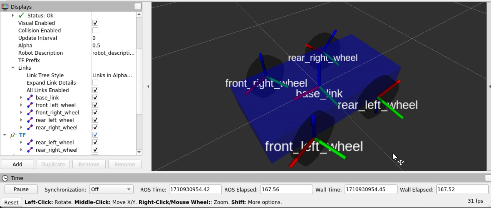
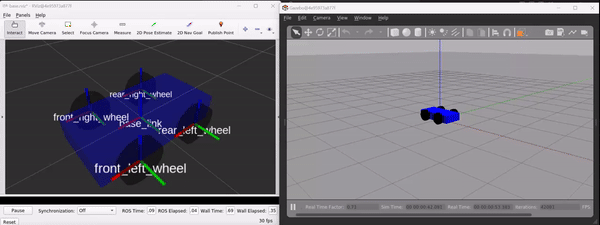
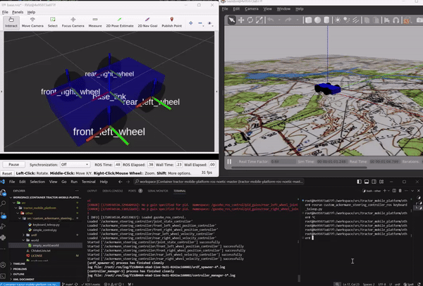

## Implementation of steering controller based on a 4-wheel ROS Noetic platform for simulation in Gazebo

## Abstract

This paper discusses an example of creating a simulation model of a four-wheeled mobile platform with an Ackermann-type steering controller, using the `ROS' framework`. `Gazebo` is chosen as the simulation environment. Examples of describing the robot architecture, via the `urdf` format, are given, a custom controller is developed to control the wheels of the model, and a general approach to designing simulation models of robotic systems is shown.





## Contents 
- [Implementation of steering controller based on a 4-wheel ROS Noetic platform for simulation in Gazebo](#implementation-of-steering-controller-based-on-a-4-wheel-ros-noetic-platform-for-simulation-in-gazebo)
- [Abstract](#abstract)
- [Contents](#contents)
- [Sources](#sources)
- [Pre-requisites](#pre-requisites)
- [ROS Package Creation](#ros-package-creation)
- [Introduction to Ackermann Geometry](#introduction-to-ackermann-geometry)
- [Creating a URDF robot simulation model (Xacro)](#creating-a-urdf-robot-simulation-model-xacro)
- [Integration with ros\_control for Gazebo](#integration-with-ros_control-for-gazebo)
- [Ackermann Steering Controller Implementation](#ackermann-steering-controller-implementation)
- [Robot Control System Implementation](#robot-control-system-implementation)
- [Forming the launch file (launch)](#forming-the-launch-file-launch)
- [Simulation](#simulation)
  - [YouTube Video](#youtube-video)
- [Conclusion](#conclusion)
- [Contacts to contact me:](#contacts-to-contact-me)

## Sources
Source code:
- [GitHub](https://github.com/AntonSHBK/custom_ackermann_steering_controller_ros).

Useful articles:
- [URDF tutorial](https://wiki.ros.org/urdf/Tutorials);
- [Xacro ROS docs](https://wiki.ros.org/xacro);
- [ROS Controls (official)](https://wiki.ros.org/ros_control);
- [ROS Controls (Gazebo)](https://classic.gazebosim.org/tutorials?tut=ros_control#Defaultgazebo_ros_controlBehavior);
- [Sdf, gazebo, world](https://classic.gazebosim.org/tutorials?tut=ros_roslaunch);
- [SDF format (description of tags used)](http://sdformat.org/spec);
- [Ackermann steering geometry (Wikipedia)](https://en.wikipedia.org/wiki/Ackermann_steering_geometry);
- [ROS messages](https://wiki.ros.org/msg);
- [Geometry messages](https://docs.ros.org/en/api/geometry_msgs/html/index-msg.html);
- [Teleop_twist_keyboard control](https://wiki.ros.org/teleop_twist_keyboard);
- [Roslaunch, launch management](http://docs.voltbro.ru/starting-ros/administrirovanie-ros/roslaunch.html);
- [Roslaunch tips for large projects](https://wiki.ros.org/ROS/Tutorials/Roslaunch%20tips%20for%20larger%20projects).


Useful videos:
- [Practical Intro to ROS and URDF #1](https://www.youtube.com/watch?v=7rLXC4xvSGw)
- [Practical Intro to ROS and OpenCV #2](https://www.youtube.com/watch?v=2-Taue1Ue_8&t=1838s)

## Pre-requisites
- Installed `ROS` (`ROS Noetic`);
- Created `ROS`;
- `Python 3.x`.

I use the `Docker` containerization technology (and recommend it to you, [example use case](https://github.com/AntonSHBK/ROS-2-HUMBLE-DOCKER/tree/main)), eliminates the need to deploy a virtual environment (`Ubuntu`). I use [VcXsrv Windows X Server](https://sourceforge.net/projects/vcxsrv/) to reproduce the GUI (`Rviz`, `Gazebo`).

You need to configure and run `X server` (`VcXsrv`) before running the container. Using `VcXsrv` is a simple approach to connecting the GUI in a Docker container and local machine. You can learn more [here](https://wiki.ros.org/docker/Tutorials/Compose).

Detailed configuration of [`ROS GUI`](https://wiki.ros.org/docker/Tutorials/GUI) support. If you need more customizations, read [here](https://habr.com/ru/companies/stc_spb/articles/657927/).

 |  

 |  

Once run, you can play the GUI from the container. Usage: when running `VcXsrv` I recommend to switch the language to English, otherwise you will have problems with filling fields in `RViz`.

## ROS Package Creation

- [Create ROS package by hand](https://wiki.ros.org/ROS/Tutorials/Creating%20a%20Package%20by%20Hand)
- [Detailed description of CmakeList.txt](http://wiki.ros.org/catkin/CMakeLists.txt)

Here I've shown how my ROS package looks like, you can read more about building `ROS' packages in the official documentation. All this is necessary for normal start of the project.

[``CmakeList.txt``](https://github.com/AntonSHBK/custom_ackermann_steering_controller_ros/blob/main/CMakeLists.txt):
```cmake
cmake_minimum_required(VERSION 3.0.2)
project(custom_ackermann_steering_controller_ros)
## Find catkin macros and libraries
find_package(catkin REQUIRED COMPONENTS roscpp rospy std_msgs)
catkin_package()
include_directories( ${catkin_INCLUDE_DIRS})
catkin_install_python(
    PROGRAMS
    scripts/ackermann_steering_controller.py
    scripts/simple_control.py
    scripts/keyboard_teleop.py
    DESTINATION ${CATKIN_PACKAGE_BIN_DESTINATION})
```
[`package.xml`](https://github.com/AntonSHBK/custom_ackermann_steering_controller_ros/blob/main/package.xml):
```xml
<?xml version="1.0"?>
<package format="2">
  <name>custom_ackermann_steering_controller_ros</name>
  <version>0.0.0.1</version>
  <description>custom_ackermann_steering_controller_ros</description>
  <maintainer email="anton42@yandex.ru">Anton Pisarenko</maintainer>
  <license>MIT</license>

  <buildtool_depend>catkin</buildtool_depend>

  <exec_depend>roscpp</exec_depend>
  <exec_depend>rospy</exec_depend>
  <exec_depend>rviz</exec_depend>
  <exec_depend>std_msgs</exec_depend>
  <exec_depend>tf</exec_depend>
  <exec_depend>urdf</exec_depend>
  <exec_depend>xacro</exec_depend>

  <exec_depend>controller_manager</exec_depend>
  <exec_depend>gazebo_ros</exec_depend>
  <exec_depend>gazebo_ros_control</exec_depend>
  <exec_depend>joint_state_controller</exec_depend>
  <exec_depend>position_controllers</exec_depend>
  <exec_depend>velocity_controllers</exec_depend>
  <exec_depend>robot_state_publisher</exec_depend>
  <exec_depend>rqt_robot_steering</exec_depend>
</package>
```

## Introduction to Ackermann Geometry

Ackermann geometry is a fundamental principle in the design of control systems for four-wheeled vehicles, providing optimal turning by adjusting the steering angles of the front wheels. This principle is particularly relevant for steerable mobile robots where efficient, predictable, and safe turning must be achieved.

__Fundamentals of Ackermann Geometry__.
Ackermann geometry is based on the idea that all wheels should be oriented towards the centre of the turning circle during a turn. This reduces wheel slippage and wear, improving handling. To achieve this, the front wheels are turned at different angles. Ideally, lines drawn through the axes of rotation of all the wheels should intersect at a single point on the axis of the rear wheels (image for reference, taken from [Wikipedia]((https://en.wikipedia.org/wiki/Ackermann_steering_geometry)))).

 

__Key Elements__

Wheelbase (W): The distance between the centres of the front and rear axles.
Track width (Track width, T): The distance between the left and right wheels on the same axle.
Turning Radius (R): The radius of the circle that describes the centre of the vehicle when turning a maximum angle.

__Mathematical expression__.

Ackermann geometry requires that the front wheel angles ($\theta_L$ for the left wheel and $\theta_R$ for the right wheel) be set so that the following condition is met:

$$ \frac{1}{r_{lk}+\frac{l_{pot}}{2}}=\frac{\tan(\delta_L)}{W_C}, \frac{1}{r_{lk}-\frac{l_{pot}}{2}}=\frac{\tan(\delta_R)}{W_C} $$
Where:
- $r_{lk}$ is the radius of the turning circle of the vehicle,
- $W_C$ is the distance between the axles of the driving wheels and the driven wheels,
- $l_{pot}$ is the width between the centres of the wheels on the same axle,
- $\delta_L, \delta_R$ are the steering angles for the left and right front wheels, respectively.

__In Robotics__

In the context of mobile robots, Ackermann geometry allows us to accurately determine the steering angles of the front wheels for a given turning radius. This is particularly important in the design of control algorithms where smooth and accurate robot manoeuvring behaviour must be achieved.

[To Contents](#Contents)

## Creating a URDF robot simulation model (Xacro)

Creating any simulation model in `ROS` starts with designing a structure describing the robot structure in `urdf` format: links, joints, their mass-inertia characteristics, other physical properties, and the drivetrain. 

Designing a `URDF` (Unified Robot Description Format) file for a robot with an Ackermann control system can be quite challenging because it requires taking into account many details, including the physical dimensions, weights, and locations of the robot components. For simplicity, we will design a small four-wheeled robot where the front wheels are controlled according to the Ackermann control principle. The constructed model can be further extended and modified according to the specific requirements of the project.

The robot design paradigm presented in `ROS` recommends describing robots in `urdf` format, but for describing some complex configurations it is possible to use `sdf`, a very similar format, with some differences. The principle of forming the final file is `xacro -> urdf -> sdf`. So in the end `ros` works with an sdf file. You can refer to the [documentation]((http://sdformat.org/spec)) to familiarise yourself with the available tags when describing a file. In our case we will focus on `urdf`(`xacro`).

The projected `URDF` robot design should include the following elements:
- Joints for wheel rotation: For the front wheels that rotate for directional control, joints of type `revolute` that allow rotation about the vertical axis should be defined.
- Joints for wheel rotation: All wheels (both front and rear) shall have joints that allow them to rotate to simulate motion, type `continuous'.
- Transmissions: The `URDF` must describe the transmissions connecting each connection to the appropriate controller in `ros-controls`. This includes defining the type of actuator (e.g. electric motor) and the control method (e.g. speed, position or force).

To increase the scalability and flexibility of the project, we will perform a small decomposition of the robot structure, namely creating several files in the `urdf` directory:
- [`main.xacro`](https://github.com/AntonSHBK/custom_ackermann_steering_controller_ros/blob/main/urdf/main.xacro) - the main file that describes the robot, connects all other description files (xacro); 
- [`common_macro.xacro`](https://github.com/AntonSHBK/custom_ackermann_steering_controller_ros/blob/main/urdf/common_macro.xacro) - file that contains frequently used code fragments, global permutations applicable to other files;
- [`corpus.xacro`](https://github.com/AntonSHBK/custom_ackermann_steering_controller_ros/blob/main/urdf/corpus.xacro) - a file describing the enclosure.
- [`wheel.xacro`](https://github.com/AntonSHBK/custom_ackermann_steering_controller_ros/blob/main/urdf/wheel.xacro) - file describing the wheel.
  
We describe the robot in `xacro` format, as it gives us more possibilities and scalability of the code. The files are located in the `urdf` directory of the root project so that any designer could understand that the robot description is located there.

This principle of decomposition was adopted for the following reason: each unique element of the structure should be described separately from the others, the assembly itself is also described in a separate file (as in the design of assemblies - parts, assemblies).

For the robot structure under development, we will assume simple geometry shapes: parallelepiped as the body and cylinders as wheels. In the future it is possible to replace simple shapes with more detailed models in `stl` or `dae` format, if necessary

[`common_macro.xacro`:](https://github.com/AntonSHBK/custom_ackermann_steering_controller_ros/blob/main/urdf/common_macro.xacro)
```xml
<?xml version="1.0"?>
<robot name="common_macro" xmlns:xacro="http://www.ros.org/wiki/xacro">

<!-- *********************************************************************** -->
<!-- Constance -->

<xacro:property name="PI" value="3.14"/>

<!-- *********************************************************************** -->
<!-- Inertial matrix for cylinder -->
<xacro:macro name="cylinder_inertia" params ="m r h">
  <inertial>
   <mass value="${m}"/>
   <inertia ixx="${m*(3*r*r+h*h)/12}"  ixy="0.0" ixz="0.0"
            iyy="${m*(3*r*r+h*h)/12}"  iyz="0.0" izz="${m*r*r/2}"/>
   </inertial>
</xacro:macro>

<!-- *********************************************************************** -->
<!-- Base inertial matrix -->
<xacro:macro name= "inertial_matrix" params="mass">
  <inertial>
    <mass value="${mass}"/>
    <inertia 
        ixx="1.0" ixy="0.0"
        iyy="1.0" iyz="0.0"
        izz="1.0" ixz="0.0"/>
   </inertial>
 </xacro:macro>
```
[`corpus.xacro`:](https://github.com/AntonSHBK/custom_ackermann_steering_controller_ros/blob/main/urdf/corpus.xacro)
```xml
<?xml version="1.0"?>
<robot name="corpus" xmlns:xacro="http://www.ros.org/wiki/xacro">

<xacro:include filename="$(find custom_ackermann_steering_controller_ros)/urdf/common_macro.xacro" />

<!-- *********************************************************************** -->

<xacro:macro 
    name="corpus" 
    params="
        link_name  
        length
        width
        height
        mass">
    <link name="${link_name}">
        <visual>
            <origin 
                rpy= "0 0 0"
                xyz= "0 0 0"/>
            <geometry>
                <box size="${length} ${width} ${height}"/>
            </geometry>
            <material name="Blue">
                <color rgba="0.0 0.0 1.0 1.0"/>
            </material>
        </visual>
        <collision>
             <origin 
                rpy= "0 0 0"
                xyz= "0 0 0"/>
            <geometry>
                <box size="${length} ${width} ${height}"/>
            </geometry>
        </collision>
        <xacro:inertial_matrix mass="${mass}"/>
    </link>
    <gazebo reference ="${link_name}">
        <material>Gazebo/Blue</material>
    </gazebo>
</xacro:macro>
</robot>

```
[`wheel.xacro`:](https://github.com/AntonSHBK/custom_ackermann_steering_controller_ros/blob/main/urdf/wheel.xacro)
```xml
<?xml version="1.0"?>
<robot name="wheel" xmlns:xacro="http://www.ros.org/wiki/xacro">

<xacro:include filename="$(find custom_ackermann_steering_controller_ros)/urdf/common_macro.xacro" />

<!-- *********************************************************************** -->

<xacro:macro 
    name="wheel" 
    params="
        link_name
        radius 
        length 
        mass">
    <link name="${link_name}">
        <visual>
            <origin rpy="${PI/2} 0 0" xyz="0 0 0"/> 
            <geometry>
                <cylinder length="${length}" radius="${radius}"/>
            </geometry>
            <material name="Black">
                <color rgba="0.0 0.0 0.0 0.9"/>
            </material>
        </visual>
        <collision>
            <origin rpy="${PI/2} 0 0" xyz="0 0 0"/> 
            <geometry>
                <cylinder length="${length}" radius="${radius}"/>
            </geometry>
        </collision>
        <xacro:cylinder_inertia m="${mass}" r="${radius}" h="${length}"/>
    </link>
    <gazebo reference ="${link_name}">
        <material>Gazebo/Black</material>
    </gazebo> 
</xacro:macro>
</robot>

```
[`main.xacro`:](https://github.com/AntonSHBK/custom_ackermann_steering_controller_ros/blob/main/urdf/main.xacro)
```xml
<?xml version="1.0"?>
<robot name="ackermann_robot" xmlns:xacro="http://www.ros.org/wiki/xacro">

<!-- *********************************************************************** -->
<!-- Include xacro-->
<xacro:include filename="$(find custom_ackermann_steering_controller_ros)/urdf/common_macro.xacro" />
<xacro:include filename="$(find custom_ackermann_steering_controller_ros)/urdf/corpus.xacro" />
<xacro:include filename="$(find custom_ackermann_steering_controller_ros)/urdf/wheel.xacro" />

<!-- *********************************************************************** -->
<!-- Arguments -->
<xacro:property name="PI" value="3.14"/>

<xacro:property name="corpus_len" value="1.0"/>
<xacro:property name="corpus_width" value="0.5"/>
<xacro:property name="corpus_height" value="0.2"/>
<xacro:property name="corpus_mass" value="5"/>

<xacro:property name="wheel_radius" value="0.15"/>
<xacro:property name="wheel_width" value="0.08"/>
<xacro:property name="wheel_mass" value="0.5"/>

<xacro:property name="angle_wheel_limit" value="${PI/4}"/>

<!-- *********************************************************************** -->

<xacro:corpus 
    link_name="base_link" 
    length="${corpus_len}" 
    width="${corpus_width}" 
    height="${corpus_height}" 
    mass="${corpus_mass}" />

<!-- *********************************************************************** -->

<xacro:wheel 
    link_name="front_left_wheel"
    radius="${wheel_radius}"
    length="${wheel_width}"
    mass="${wheel_mass}"/>

<xacro:wheel 
    link_name="front_right_wheel"
    radius="${wheel_radius}"
    length="${wheel_width}"
    mass="${wheel_mass}"/>

<xacro:wheel 
    link_name="rear_left_wheel"
    radius="${wheel_radius}"
    length="${wheel_width}"
    mass="${wheel_mass}"/>

<xacro:wheel 
    link_name="rear_right_wheel"
    radius="${wheel_radius}"
    length="${wheel_width}"
    mass="${wheel_mass}"/>

<!-- Joints for для connect forward wheels with corpus -->
<joint name="front_left_wheel_joint" type="revolute">
    <parent link="base_link"/>
    <child link="front_left_wheel"/>
    <origin xyz="0.25 0.3 0" rpy="0 0 0"/>
    <axis xyz="0 0 1"/>
    <limit lower="${-angle_wheel_limit}" upper="${angle_wheel_limit}" effort="1000" velocity="1"/>
</joint>

<joint name="front_right_wheel_joint" type="revolute">
    <parent link="base_link"/>
    <child link="front_right_wheel"/>
    <origin xyz="0.25 -0.3 0" rpy="0 0 0"/>
    <axis xyz="0 0 1"/>
    <limit lower="${-angle_wheel_limit}" upper="${angle_wheel_limit}" effort="1000" velocity="1"/>
</joint>

<!-- Joints for для connect back wheels with corpus -->
<joint name="rear_left_wheel_joint" type="continuous">
    <parent link="base_link"/>
    <child link="rear_left_wheel"/>
    <origin xyz="-0.25 0.3 0" rpy="0 0 0"/>
    <axis xyz="0 1 0"/>
</joint>

<joint name="rear_right_wheel_joint" type="continuous">
    <parent link="base_link"/>
    <child link="rear_right_wheel"/>
    <origin xyz="-0.25 -0.3 0" rpy="0 0 0"/>
    <axis xyz="0 1 0"/>
</joint>
</robot>
```

Here we have described the links and connections (mutual arrangement of the links). We have used variables, this allows flexible and fast configuration of the project.

Let's add a transmission for the links. The transmission will link the link to the controller through a defined interface. 

To add transmissions for each wheel in the `urdf` file of the robot, we need to extend the robot definition to include `<transmission>` elements. These elements link joints (`<joint>`) to actuators via `hardware_interfaces`, allowing `ros_control` to control physical or simulation actuators.

These `<transmission>` blocks are added to the end of the `urdf` (`xacro`) file (in our case `xacro`), after the definitions of all joints (`<joint>`) and before the closing tag `</robot>`. They indicate that a different drivetrain is used for each wheel, linking the joints to the actuators through specific interfaces. For the front driven wheels, the `PositionJointInterface` is used, which implies position (steering angle) control, and for the rear driven wheels, the `VelocityJointInterface` is used, which controls wheel speed.

Let's put the description of the transmissions in `common_macro.xacro`. This way we reduce the amount of code and increase readability.

Extend `common_macro.xacro`:

```xml
<!-- *********************************************************************** -->
<!-- Wheel Turn Transmission -->
<xacro:macro name="Front_transmission" params="joint_name">
    <transmission name="${joint_name}_transmission">
        <type>transmission_interface/SimpleTransmission</type>
        <joint name="${joint_name}">
          <hardwareInterface>hardware_interface/PositionJointInterface</hardwareInterface>
        </joint>
        <actuator name="${joint_name}_actuator">
          <hardwareInterface>hardware_interface/PositionJointInterface</hardwareInterface>
          <mechanicalReduction>1</mechanicalReduction>
        </actuator>
      </transmission>
</xacro:macro>

<!-- *********************************************************************** -->
<!-- Wheel Spin Transmission -->
<xacro:macro name="Back_transmission" params="joint_name">
    <transmission name="${joint_name}_transmission">
        <type>transmission_interface/SimpleTransmission</type>
        <joint name="${joint_name}">
          <hardwareInterface>hardware_interface/VelocityJointInterface</hardwareInterface>
        </joint>
        <actuator name="${joint_name}_actuator">
          <hardwareInterface>hardware_interface/VelocityJointInterface</hardwareInterface>
          <mechanicalReduction>1</mechanicalReduction>
        </actuator>
      </transmission>
</xacro:macro>
```

Extend ``main.xacro``:
```xml
<!-- Transmission for front left steering wheel -->
<xacro:Front_transmission joint_name="front_left_wheel_joint"/>
    
<!-- Transmission for front right steering wheel -->
<xacro:Front_transmission joint_name="front_right_wheel_joint"/>

<!-- Transmission for rear left driven wheel -->
<xacro:Back_transmission joint_name="rear_left_wheel_joint"/>

<!-- Transmission for rear right drive wheel -->
<xacro:Back_transmission joint_name="rear_right_wheel_joint"/> 
```

After adding all the necessary joints and gears, the `URDF` model is ready to be used with `ros-controls` to implement the control mechanisms. Another important element is to add the information for `gazebo` (`gazebo_ros_control`) to the robot description. Let's extend the `main.xacro` file:

```xml
<gazebo>.
    <plugin name="gazebo_ros_control" filename="libgazebo_ros_control.so">
        <robotNamespace>/</robotNamespace>
    </plugin>
</gazebo>
```


[To Contents](#Contents)

## Integration with ros_control for Gazebo


- [ROS Controls (official)](https://wiki.ros.org/ros_control);
- [ROS Controls (Gazebo)](https://classic.gazebosim.org/tutorials?tut=ros_control#Defaultgazebo_ros_controlBehavior)
- [ROS Tutorial: Control the UR5 robot with ros_control - How to tune a PID Controller](https://roboticscasual.com/ros-tutorial-control-the-ur5-robot-with-ros_control-tuning-a-pid-controller/)

After adding connections and transmissions to `urdf` (in our case `xacro`), you need to configure the parameters for `ros_control` in the `YAML` configuration file. To configure `ros_control`, you need to create a `YAML` configuration file (usually located in the `config` directory), which is a standard for projects using `ROS`. The configuration file defines controllers for each wheel, and also contains variables needed for calculations, such as: distance between front and rear axle (`wheel_base`), distance between wheel centers on the same axle (`wheel_track`), names of "tops" for subscription and publishing, and other configurable parameters. You can also include any customizable parameters, which will increase the flexibility of the configuration.
Create a file `ackermann_steering_config.yaml` in the `config`.

```yaml
ackermann_steering_controller:
  # ros_control parameters
  joint_state_controller:
    type: joint_state_controller/JointStateController
    publish_rate: 50

  wheel_base: 0.5 # Distance between front and rear axle
  wheel_track: 0.5 # Distance between wheels on axle
  max_steering_angle: 0.7854 # Maximum wheel steering angle in radians

  cmd_vel_topic: "/cmd_vel" # Topic to subscribe to control commands
  steering_angle_topic: "/steering_angle" # Topic for publishing steering angle
  drive_velocity_topic: "/drive_velocity"

  # Controllers for steering front wheels
  front_left_wheel_position_controller:
    type: position_controllers/JointPositionController
    joint: front_left_wheel_joint

  front_right_wheel_position_controller:
    type: position_controllers/JointPositionController
    joint: front_right_wheel_joint
  
  # Controllers for driving rear wheels
  rear_left_wheel_velocity_controller:
    type: velocity_controllers/JointVelocityController
    joint: rear_left_wheel_joint

  rear_right_wheel_velocity_controller:
    type: velocity_controllers/JointVelocityController
    joint: rear_right_wheel_joint
```
This configuration file defines a joint state controller (`joint_state_controller`) that publishes the state of all joints in the robot. Controllers for each of the front and rear wheels are also defined. The front wheels use position controllers (`JointPositionController`) and the rear wheels use velocity controllers (`JointVelocityController`), corresponding to their functions in an Ackermann-type steerable system.

    Note, the error associated with the `pid` controller for the simulation in `Gezebo` is not significant. If you use `pid` controllers read the official [documentation](https://wiki.ros.org/pid).

```
[ERROR] [1710926628.173440521]: No p gain specified for pid.  Namespace: /gazebo_ros_control/pid_gains/front_left_wheel_joint
```

To use this configuration file when running your ROS node, it must be downloaded via `roslaunch`, but we will describe this step a little later on

This approach makes configuration management easier and allows you to easily adapt the software to different environments without having to modify the source code.

[To Contents](#Contents).

## Ackermann Steering Controller Implementation

- [Publisher and Subscriber Python tutorial ROS 1](https://wiki.ros.org/ROS/Tutorials/WritingPublisherSubscriber%28python%29)
- [ROS messages](https://wiki.ros.org/msg)
- [Geometry messages](https://docs.ros.org/en/api/geometry_msgs/html/index-msg.html)

To realize Ackermann-type steering using `ROS` and in integration with `ros-controls`, let's create our own controller: define the interconnections and also define the logic for controlling the wheels. To do this, let's create a script in `python`. Let's define a new class in which we initialize `ROS` node. It is obligatory to read the parameters from the system, which we defined in the previous step. Then we will sign our node to the control topic in this case `/cmd_vel` and read messages from it with some periodicity. Having the command topic, we will realize the logic of calculating the Ackermann geometry, namely: define the function of calculating the wheel rotation catch and the function of calculating the speed of the drive wheels.

Below is the controller file (`python` script files are located in the `/scripts` directory), I tried to make it as clear as possible. Don't forget to add the script to the `CmakeList.txt` build file if you make the project yourself.

[`ackermann_steering_controller.py`](https://github.com/AntonSHBK/custom_ackermann_steering_controller_ros/blob/main/scripts/ackermann_steering_controller.py):
```python
#!/usr/bin/env python
# -*- coding: utf-8 -*-

import rospy
from geometry_msgs.msg import Twist
from std_msgs.msg import Float64

import math


class AckermannSteeringController:
    def __init__(self):
        self.name = '/ackermann_steering_controller'
        
        rospy.init_node('ackermann_steering_controller', anonymous=True)

        # Load parameters from the configuration file
        self.wheel_base = rospy.get_param(self.name+'/wheel_base', 1.0)
        self.cmd_vel_topic = rospy.get_param(self.name+'/cmd_vel_topic', '/cmd_vel')
        self.drive_velocity_topic = rospy.get_param(self.name+'/drive_velocity_topic', '/drive_velocity')
        self.wheel_track = rospy.get_param(self.name+'/wheel_track', 0.5)
        self.max_steering_angle = rospy.get_param(self.name+'/max_steering_angle', 0.7854)

        # Subscriber to a topic with control commands
        rospy.Subscriber(self.cmd_vel_topic, Twist, self.cmd_vel_callback)
        
        # Publishers to send commands to the wheel controllers
        self.front_left_wheel_pub = rospy.Publisher(self.name+'/front_left_wheel_position_controller/command', Float64, queue_size=1)
        self.front_right_wheel_pub = rospy.Publisher(self.name+'/front_right_wheel_position_controller/command', Float64, queue_size=1)
        self.rear_left_wheel_pub = rospy.Publisher(self.name+'/rear_left_wheel_velocity_controller/command', Float64, queue_size=1)
        self.rear_right_wheel_pub = rospy.Publisher(self.name+'/rear_right_wheel_velocity_controller/command', Float64, queue_size=1)

    def cmd_vel_callback(self, data):
        # Get linear velocity and angular velocity
        linear_velocity = data.linear.x
        angular_velocity = data.angular.z

        
        # Calculate the radius of rotation from angular velocity and linear velocity
        If angular_velocity == 0 or linear_velocity == 0:
            radius = float('inf')
        else:
            radius = linear_velocity / angular_velocity            
            
        # Calculate steering angles for the front wheels
        left_steering_angle, right_steering_angle = self.calculate_steering_angles(radius)

        # Rear wheel speed adaptation
        left_rear_wheel_velocity, right_rear_wheel_velocity = self.calculate_wheel_velocities(radius, linear_velocity)

        # Publish rotation angles and velocities
        self.front_left_wheel_pub.publish(Float64(left_steering_angle))
        self.front_right_wheel_pub.publish(Float64(right_steering_angle))
        self.rear_left_wheel_pub.publish(Float64(left_rear_wheel_velocity))
        self.rear_right_wheel_pub.publish(Float64(right_rear_wheel_velocity))
        
    # Calculate steering angles
    def calculate_steering_angles(self, radius):
        If radius == float('inf'):
            return 0.0, 0.0
        left_angle = math.atan(self.wheel_base / (radius + self.wheel_track / 2))
        right_angle = math.atan(self.wheel_base / (radius - self.wheel_track / 2)))
        return left_angle, right_angle

    # Calculate wheel speed
    def calculate_wheel_velocities(self, radius, linear_velocity):
        if radius == float('inf'):
            return linear_velocity, linear_velocity
        left_velocity = linear_velocity * (radius - self.wheel_track / 2) / radius
        right_velocity = linear_velocity * (radius + self.wheel_track / 2) / radius
        return left_velocity, right_velocity


if __name__ == '__main__':
    try:
        controller = AckermannSteeringController()
        rospy.spin()
    except rospy.ROSInterruptException:
        pass
```
    
    Note: remember to make the script executable if you run the script manually, incompatible with `rosrun`:

```bush
chmod +x scripts/ackermann_steering_controller.py
```

This controller takes into account the steering angles for each of the front wheels, which are calculated by taking into account the turning radius and track width. In addition, to simulate differential turning, the speeds of the rear wheels are adapted depending on the steering angle, thus providing more realistic steering.

This controller will now subscribe to the `/cmd_vel` topic, expecting messages of type `Twist` that contain linear and angular velocity information. Based on this data, the controller will calculate the steering angle for the steering and post it to the appropriate topics.

[To Contents](#Contents).

## Robot Control System Implementation

- [Publisher and Subscriber Python tutorial ROS 1](https://wiki.ros.org/ROS/Tutorials/WritingPublisherSubscriber%28python%29)
- [geometry_msgs/Twist Message](https://docs.ros.org/en/api/geometry_msgs/html/msg/Twist.html)
- [teleop_twist_keyboard](https://wiki.ros.org/teleop_twist_keyboard)

To make a robot model move in a simulator that uses `ROS` (e.g. `Gazebo`), you need to send the appropriate commands to a topic (in our case `/cmd_vel`) that controls the robot's movement. It takes messages of type `geometry_msgs/Twist` as input. A message of `Twist` type allows to set linear and angular velocity along the axis directions. The efficiency and accuracy of such commands depends on the characteristics of your robot and the simulator settings. It is also important to keep in mind that constantly sending speed commands without stopping may cause the robot to continue moving until it receives a command to stop or change speed.

To implement robot control via keyboard keys in `ROS`, we can use the [`teleop_twist_keyboard`](https://wiki.ros.org/teleop_twist_keyboard) package, which allows `geometry_msgs/Twist` messages to be sent to the `/cmd_vel` topic, thus controlling the robot's linear and angular velocity. However, we will implement our own implementation of keyboard control (stalks up, down, etc.), write a simple `Python` script using the `curses` library to read keystrokes without having to press `Enter`.

[keyboard_teleop.py:](https://github.com/AntonSHBK/custom_ackermann_steering_controller_ros/blob/main/scripts/keyboard_teleop.py)
```python
#!/usr/bin/env python
# -*- coding: utf-8 -*-

import rospy
from geometry_msgs.msg import Twist

import curses

# Function to process keystrokes
def keypress(stdscr):
    # ROS initialization
    rospy.init_node('keyboard_teleop', anonymous=True)
    pub = rospy.Publisher('/cmd_vel', Twist, queue_size=1)
    rate = rospy.Rate(10) # 10hz

    twist = Twist()

    # Disable input buffering, make getch non-blocking
    stdscr.nodelay(True)
    stdscr.clear()

    while not rospy.is_shutdown():
        try:
            key = stdscr.getch() # Get the code of the pressed key
            stdscr.refresh()

            # Select the action depending on the pressed key
            if key == curses.KEY_UP:
                twist.linear.x += 0.1
            elif key == curses.KEY_DOWN:
                twist.linear.x -= 0.1
            elif key == curses.KEY_LEFT:
                twist.angular.z += 0.1
            elif key == curses.KEY_RIGHT:
                twist.angular.z -= 0.1
            elif key == ord('s'):
                twist.linear.x = 0
                twist.angular.z = 0
            elif key == ord('q'):
                break

            pub.publish(twist)
            rate.sleep()
        except Exception as e:
            # Exception handling (e.g., when closing a window)
            break

# Use curses to handle keystrokes
curses.wrapper(keypress)
```

This script initializes the `ROS` node, creates a publisher for the `/cmd_vel` topic, and uses the `curses` library to read keystrokes and publishes `Twist` messages to the `/cmd_vel` topic. Use the arrows to control the speed and direction of movement, `'s'` to stop and `'q'` to exit.

To run the script, save it to a file such as `keyboard_teleop.py`, make the file executable (`chmod +x keyboard_teleop.py`) and run it using `rosrun` or you can add it to the `launch` package file. Remember to add the script to `CmakeList.txt`.

[To Contents](#Contents)

## Forming the launch file (launch)

The final stage is the preparation of the launch file (`.launch`). In fact, the launch file is formed at all stages of project writing, and is constantly being expanded, modified and adjusted.

The launch file (`launch` file) in `ROS` plays an important role in controlling the startup and configuration of nodes, parameters, namespaces, and other system elements. These files are written according to `XML` rules, but with the extension `.launch`. They provide a mechanism for automating the complex process of launching multiple nodes and configuring their interactions. 

__Centralized management:__

* Launch organization: `Launch` files allow multiple nodes to be launched with a single command, simplifying and centralizing the process of launching complex systems, including various drivers, algorithms, and visualization tools.
* Configuration -- through these files, you can customize node parameters by specifying the parameter values to be used by the nodes at runtime.
* Flexibility and scalability
* Parameterization - allows you to specify startup parameters, making the system flexible and easily adaptable to different environments and configurations.
* Namespaces - supports the use of namespaces to isolate nodes, making large and complex systems easier to manage.

__Simplifying development and testing:__

- Reusability - `launch` files can be organized to allow reuse in different parts of a project or even between projects.
- Testing - simplifies the testing process by allowing quick launch and reconfiguration for different testing scenarios and conditions.

__Main elements of the launch file:__

- `<node>` - element for launching a node. It specifies package name, type (executable file name), node name and additional parameters.
- `<param>` - sets a parameter on the ROS parameter server. Can set values directly or through a file.
- `<rosparam>` - loads parameters into the ROS parameter server from a YAML file, which allows you to manage more complex data structures.
- `<group>` - groups nodes and parameters, allowing common settings such as namespace to be applied to them.
- `<include>` - includes another launch file, allowing modularity and code reuse.
- `<arg>` - defines arguments that can be passed to the launch file, making its configuration even more flexible.

The use of `launch` files in `ROS` greatly simplifies the process of developing, launching and controlling robotic systems, allowing you to focus on solving problems rather than routinely managing the launching of system components.

To launch these controllers with `ros_control`, add the appropriate section to the launch file (`.launch`) that loads this configuration and initializes `controller_manager` with these controllers.

To load the controller configuration defined in the `YAML` file and initialize `controller_manager` with those controllers, you can create a `.launch` file. This file will include several key elements: loading the robot description into the `robot_description` parameter, loading the controller configuration from the `YAML` file, launching `robot_state_publisher` to publish joint states and transformations, and launching the `controller_manager`.

So here we go. We will again resort to decomposition of the launch file, breaking it into several local files, namely: the main launch file - `ackermann_run.launch`, it will connect other necessary launch files, and may also contain overen arguments; the `Rviz` tool launch file - `rviz. launch`, to analyze the design of the robot, to check the links, as well as the mutual arrangement of the links (it is convenient to periodically check the design during the design process, to detect an error at the early stages of design); the simulation launch file, in our case `Gazebo` - `gazebo.launch`, which contains information about the simulation world, about the necessary plug-in extensions (`controller_manager`) and others.

Let's start by forming the file for `rviz`.

[rviz.launch:](https://github.com/AntonSHBK/custom_ackermann_steering_controller_ros/blob/main/launch/rviz.launch):
```xml
<?xml version="1.0" encoding="UTF-8" ?>
<launch>
<!-- *********************************************************************** -->
<arg name="model" default="$(find custom_ackermann_steering_controller_ros)/urdf/main.xacro"/>
<!-- *********************************************************************** -->
<!-- Loading URDF of model -->
<param name="robot_description" command="$(find xacro)/xacro $(arg model)"/>
<!-- Running rviz -->
<node name="rviz" pkg="rviz" type="rviz"/>

<!-- *********************************************************************** -->
<!-- Starting services -->
<node 
    name="robot_state_publisher" 
    pkg="robot_state_publisher" 
    type="robot_state_publisher">
</node>
<!-- <node 
    name="joint_state_publisher_gui" 
    pkg="joint_state_publisher_gui" 
    type="joint_state_publisher_gui" >
</node> -->
<node 
    name="joint_state_publisher" 
    pkg="joint_state_publisher" 
    type="joint_state_publisher">
</node>
</launch>
```

The `robot_state_publisher` service uses the `URDF` specified by the `robot_description` parameter and the joint positions from the `joint_states` section to compute the robot's forward kinematics. 

The `joint_state_publisher` and `joint_state_publisher_gui` service reads the `robot_description` parameter from the parameter server, finds all uncommitted joints, and publishes a `JointState` message with all identified joints. In turn, `joint_state_publisher_gui` provides a graphical interface for changing connection parameters (wheel rotation for example). You need to run one of them, if you run both services they will conflict with each other. 
    Note: `joint_state_publisher_gui` does not work properly together with gazebo (no ability to affect connections).
When running `rviz` for the first time after adding a robot to the workspace, it is recommended to save the `rviz` startup configuration to the `rviz` directory and modify the startup file:
```xml
<arg name="rvizconfig" default="$(find custom_ackermann_steering_controller_ros)/rviz/base.rviz"/>
<node name="rviz" pkg="rviz" type="rviz" args="-d $(arg rvizconfig)"/>
```
This way, we won't have to reopen and customize everything on subsequent launches.

The next file will be `gazebo.launch`.

[``gazebo.launch``](https://github.com/AntonSHBK/custom_ackermann_steering_controller_ros/blob/main/launch/gazebo.launch):
```xml
<?xml version="1.0" encoding="UTF-8" ?>
<launch>
<!-- *********************************************************************** -->
<!-- Аргументы -->
<arg name="paused" default="true"/>
<arg name="use_sim_time" default="true"/>
<arg name="gui" default="true"/>
<arg name="headless" default="false"/>
<arg name="debug" default="false"/>
<arg name="model" default="$(find custom_ackermann_steering_controller_ros)/urdf/main.xacro"/>	
<arg name="world" default="$(find custom_ackermann_steering_controller_ros)/world/empty_world.world" />
<arg name="ackermann_steering" default="$(find custom_ackermann_steering_controller_ros)/config/ackermann_steering_config.yaml"/>
<!-- *********************************************************************** -->
<!-- Загрузка параметров конфигурации YAML -->
<rosparam file="$(arg ackermann_steering)" command="load"/>
<!-- *********************************************************************** -->
<!-- Загрузка мира для Gazebo empty_world.launch -->
<include file="$(find gazebo_ros)/launch/empty_world.launch">
	<arg name="debug" value="$(arg debug)" />
	<arg name="gui" value="$(arg gui)" />
	<arg name="paused" value="$(arg paused)" />
	<arg name="headless" value="$(arg headless)" />
	<arg name="use_sim_time" value="$(arg use_sim_time)" />
</include>
<!-- *********************************************************************** -->
<!-- Загрузка URDF модели -->
<param name="robot_description" command="$(find xacro)/xacro $(arg model)"/>
<!-- *********************************************************************** -->
<!-- Размещение робота в симуляции -->
<node name="urdf_spawner" 
	pkg="gazebo_ros" 
	type="spawn_model" 
	respawn="false" 
	output="screen"
	args="-x 0.0
		-y 0.0
		-z 0.5   
		-unpause 
		-urdf 
        -model name_robot
		-param robot_description"/>
<!-- *********************************************************************** -->
<!-- Загрузка менеджера контроллеров -->
<node 
name="controller_manager" 
pkg="controller_manager" 
type="controller_manager" 
respawn="false" 
output="screen" 
args="
	spawn 
	/ackermann_steering_controller/joint_state_controller 
	/ackermann_steering_controller/front_left_wheel_position_controller 
	/ackermann_steering_controller/front_right_wheel_position_controller 
	/ackermann_steering_controller/rear_left_wheel_velocity_controller 
	/ackermann_steering_controller/rear_right_wheel_velocity_controller" />
</launch>
```

You can read more about the specific configuration of the `Gazebo' world [here](https://classic.gazebosim.org/tutorials?tut=ros_roslaunch).

What you should pay attention to is the call of the package manager service, which passes as arguments the parameters of the controllers we have previously set in the configuration file (`yaml`).

Finally, let's write the main launch file - `ackermann_run.launch`.

[`ackermann_run.launch`](https://github.com/AntonSHBK/custom_ackermann_steering_controller_ros/blob/main/launch/ackermann_run.launch):
```xml
<?xml version="1.0" encoding="UTF-8" ?>
<launch>
<!-- *********************************************************************** -->
<arg name="model" default="$(find custom_ackermann_steering_controller_ros)/urdf/main.xacro"/>
<arg name="rvizconfig" default="$(find custom_ackermann_steering_controller_ros)/rviz/base.rviz"/>
<arg name="ackermann_steering" default="$(find custom_ackermann_steering_controller_ros)/config/ackermann_steering_config.yaml"/>
<!-- *********************************************************************** -->
<!-- Running gazebo -->
<include file="$(find custom_ackermann_steering_controller_ros)/launch/gazebo.launch">
    <arg name="model" value="$(arg model)"/>
</include>
<!-- *********************************************************************** -->
<!-- Launch rviz -->
<include file="$(find custom_ackermann_steering_controller_ros)/launch/rviz.launch">
    <arg name="model" value="$(arg model)"/>
    <arg name="rvizconfig" value="$(arg rvizconfig)"/>
</include>

<!-- *********************************************************************** -->
<!-- Starting the Ackermann controller node -->
<node 
    pkg="custom_ackermann_steering_controller_ros" 
    type="ackermann_steering_controller.py" 
    name="ackermann_steering_controller"
    output="screen"/>
</launch>
```

Everything should be clear enough here, we call the previously written `rviz.launch` and `gazebo,launch` launch files and launch the Ackermann steering controller node.

Let's summarize the launch files:
- Launches `Gazebo` with an empty world for simulation.
- Loads the `URDF` description of the robot into the ROS parameters, using xacro to process the `.xacro` file.
- Runs `robot_state_publisher`, which reads the robot description from the `ROS` parameters and publishes the state of the joints and transformations for use in other nodes, such as visualization in `RViz`.
- Starts the controller node implemented in the previous steps.
- Optionally runs `RViz` with a preconfigured configuration file to visualize the robot and its environment.
- Loads the custom configuration for the controller node from a `YAML` file.

[To Contents](#Contents)

## Simulation ###

### [YouTube Video](https://www.youtube.com/watch?v=F9TGboiuFvM&t=59s)

`rqt_graph`:


`rviz+gazebo`:


Implementation with adding a map texture, description of how to do it [here](https://classic.gazebosim.org/tutorials?tut=ros_roslaunch):




## Conclusion

This implementation of the simulation model is not perfect and is an example of the implementation of such a methodology. In the future, the model can be further complicated and other modules (camera, distance sensors, etc.) can be integrated into it. There may be errors and flaws in the work, I will be glad to have your feedback.

## Contacts to contact me:
* [Telegram](https://t.me/antonSHBK);