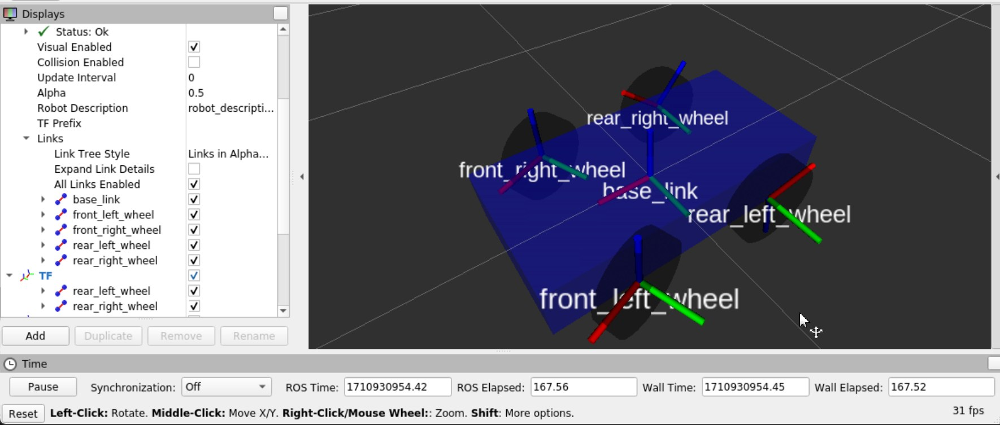
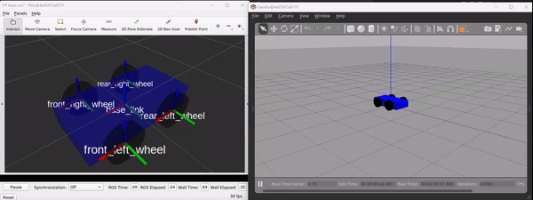
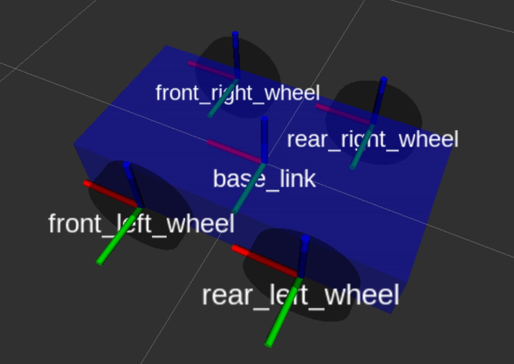
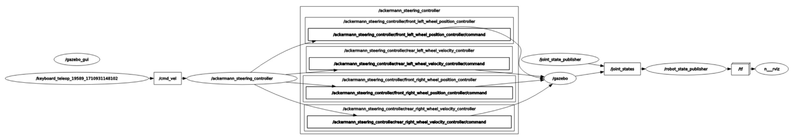
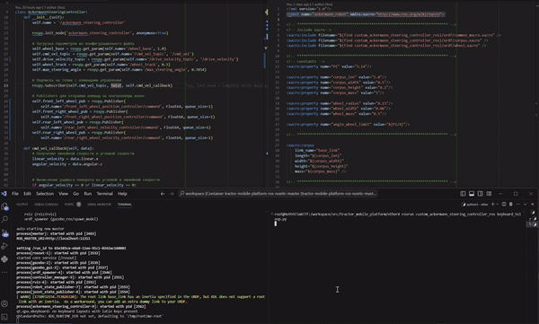
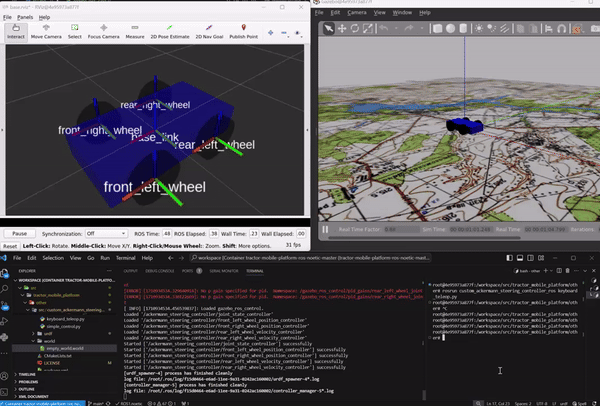

# Реализация собственного контроллера рулевого управления Аккерманна на базе 4х колёсной платформа ROS Noetic для имитационного моделирования в Gazebo

##  Аннотация

В данной работе рассматривает пример создания симуляционной модели четырёхколёсной мобильной платформы с рулевым управления по типу Аккреманна,  с использованием фреймворка `ROS`. В качестве среды симуляции выбрана `Gazebo`. Приведены примеры описания архитектуры робота, посредством формата `urdf`, разработан собственный контроллер для управления колёсами модели, а также показан общий подход к проектированию симуляционных моделей робототехнических систем.





## Содержание 
- [Реализация собственного контроллера рулевого управления Аккерманна на базе 4х колёсной платформа ROS Noetic для имитационного моделирования в Gazebo](#реализация-собственного-контроллера-рулевого-управления-аккерманна-на-базе-4х-колёсной-платформа-ros-noetic-для-имитационного-моделирования-в-gazebo)
  - [Аннотация](#аннотация)
  - [Содержание](#содержание)
  - [Источники](#источники)
  - [Предварительные требования](#предварительные-требования)
  - [Создание пакета ROS](#создание-пакета-ros)
  - [Введение в геометрию Аккерманна](#введение-в-геометрию-аккерманна)
  - [Создание имитационной URDF модели робота (Xacro)](#создание-имитационной-urdf-модели-робота-xacro)
  - [Интеграция с ros\_control для Gazebo](#интеграция-с-ros_control-для-gazebo)
  - [Реализация контроллера рулевого управления Аккерманна](#реализация-контроллера-рулевого-управления-аккерманна)
  - [Реализация системы управления роботом](#реализация-системы-управления-роботом)
  - [Формирование файла запуска (launch)](#формирование-файла-запуска-launch)
  - [Симуляция](#симуляция)
  - [Заключение](#заключение)
  - [Контакты для связи со мной:](#контакты-для-связи-со-мной)

## Источники
Исходный код:
- [GitHub](https://github.com/AntonSHBK/custom_ackermann_steering_controller_ros).

Полезные статьи:
- [URDF tutorial](https://wiki.ros.org/urdf/Tutorials);
- [Xacro ROS docs](https://wiki.ros.org/xacro);
- [ROS Controls (official)](https://wiki.ros.org/ros_control);
- [ROS Controls (Gazebo)](https://classic.gazebosim.org/tutorials?tut=ros_control#Defaultgazebo_ros_controlBehavior);
- [Sdf, gazebo, world](https://classic.gazebosim.org/tutorials?tut=ros_roslaunch);
- [SDF format (описание используемых тегов)](http://sdformat.org/spec);
- [Ackermann steering geometry (Wikipedia)](https://en.wikipedia.org/wiki/Ackermann_steering_geometry);
- [ROS messages](https://wiki.ros.org/msg);
- [Geometry messages](https://docs.ros.org/en/api/geometry_msgs/html/index-msg.html);
- [Управление teleop_twist_keyboard](https://wiki.ros.org/teleop_twist_keyboard);
- [Roslaunch, управление запуском](http://docs.voltbro.ru/starting-ros/administrirovanie-ros/roslaunch.html);
- [Roslaunch tips for large projects](https://wiki.ros.org/ROS/Tutorials/Roslaunch%20tips%20for%20larger%20projects).


Полезные видео:
- [Practical Intro to ROS and URDF #1](https://www.youtube.com/watch?v=7rLXC4xvSGw)
- [Practical Intro to ROS and OpenCV #2](https://www.youtube.com/watch?v=2-Taue1Ue_8&t=1838s)

## Предварительные требования
- Установленный `ROS` (`ROS Noetic`);
- Созданный `ROS`;
- `Python 3.x`.

Я использую технологию контейнеризации `Docker` (и вам рекомендую, [пример использования](https://github.com/AntonSHBK/ROS-2-HUMBLE-DOCKER/tree/main)), устраняет необходимость в развёртывании виртуальной среды (`Ubuntu`). Для воспроизведения графического интерфейса (`Rviz`, `Gazebo`) использую [VcXsrv Windows X Server](https://sourceforge.net/projects/vcxsrv/).

Перед запуском контейнера вам необходимо настроить и запустить `X server` (`VcXsrv`). Использование `VcXsrv` - это простой подход к подключению графического интерфейса в контейнере Docker и локальной машине. Вы можете узнать больше [здесь](https://wiki.ros.org/docker/Tutorials/Compose).

Подробная настройка поддержки [`ROS GUI`](https://wiki.ros.org/docker/Tutorials/GUI). Если вам нужны дополнительные настройки, прочитайте [здесь](https://habr.com/ru/companies/stc_spb/articles/657927/).

 |  

 |  

После запуска можно воспроизводить графический интерфейс из контейнера. Применение: при запуске `VcXsrv` рекомендую переключить язык на английский, иначе возникнут проблемы с заполнением полей  в `RViz`.

## Создание пакета ROS

- [Создание пакета ROS руками](https://wiki.ros.org/ROS/Tutorials/Creating%20a%20Package%20by%20Hand)
- [Подробное описание CmakeList.txt](http://wiki.ros.org/catkin/CMakeLists.txt)

Здесь я привёл, как выглядит мой пакет ROS, подробно о построении пакетов `ROS` можно ознакомиться в официальной документации. Всё это необходимо для нормального запуска проекта.

[`CmakeList.txt`](https://github.com/AntonSHBK/custom_ackermann_steering_controller_ros/blob/main/CMakeLists.txt):
```cmake
cmake_minimum_required(VERSION 3.0.2)
project(custom_ackermann_steering_controller_ros)
## Find catkin macros and libraries
find_package(catkin REQUIRED COMPONENTS roscpp rospy std_msgs)
catkin_package()
include_directories( ${catkin_INCLUDE_DIRS})
catkin_install_python(
    PROGRAMS
    scripts/ackermann_steering_controller.py
    scripts/simple_control.py
    scripts/keyboard_teleop.py
    DESTINATION ${CATKIN_PACKAGE_BIN_DESTINATION})
```
[`package.xml`](https://github.com/AntonSHBK/custom_ackermann_steering_controller_ros/blob/main/package.xml):
```xml
<?xml version="1.0"?>
<package format="2">
  <name>custom_ackermann_steering_controller_ros</name>
  <version>0.0.1</version>
  <description>custom_ackermann_steering_controller_ros</description>
  <maintainer email="anton42@yandex.ru">Anton Pisarenko</maintainer>
  <license>MIT</license>

  <buildtool_depend>catkin</buildtool_depend>

  <exec_depend>roscpp</exec_depend>
  <exec_depend>rospy</exec_depend>
  <exec_depend>rviz</exec_depend>
  <exec_depend>std_msgs</exec_depend>
  <exec_depend>tf</exec_depend>
  <exec_depend>urdf</exec_depend>
  <exec_depend>xacro</exec_depend>

  <exec_depend>controller_manager</exec_depend>
  <exec_depend>gazebo_ros</exec_depend>
  <exec_depend>gazebo_ros_control</exec_depend>
  <exec_depend>joint_state_controller</exec_depend>
  <exec_depend>position_controllers</exec_depend>
  <exec_depend>velocity_controllers</exec_depend>
  <exec_depend>robot_state_publisher</exec_depend>
  <exec_depend>rqt_robot_steering</exec_depend>
</package>

```

## Введение в геометрию Аккерманна

Геометрия Аккерманна является фундаментальным принципом в проектировании систем управления для четырехколесных транспортных средств, обеспечивая оптимальный поворот путем корректировки углов поворота передних колес. Этот принцип особенно актуален для мобильных роботов с рулевым управлением, где необходимо достичь эффективного, прогнозируемого и безопасного поворота.

__Основы геометрии Аккерманна__
Геометрия Аккерманна основана на идее, что все колеса должны быть ориентированы к центру поворотного круга во время поворота. Это уменьшает проскальзывание и износ колес, улучшая управляемость. Для достижения этого, передние колеса поворачиваются под разными углами. В идеале линии, проведенные через оси вращения всех колес, должны пересекаться в одной точке на оси задних колес (изображение для ознакомления, взято из [Wikipedia]((https://en.wikipedia.org/wiki/Ackermann_steering_geometry))).

 

__Ключевые элементы__

База колес (Wheelbase, W): Расстояние между центрами передней и задней осей.
Ширина колеи (Track width, T): Расстояние между левым и правым колесами на одной оси.
Радиус поворота (Turning Radius, R): Радиус круга, который описывает центр транспортного средства при повороте на максимальный угол.

__Математическое выражение__

Геометрия Аккерманна требует, чтобы углы поворота передних колес ($\theta_L$ для левого и $\theta_R$ для правого) были настроены так, чтобы выполнялось следующее условие:

$$ \frac{1}{r_{lk}+\frac{l_{pot}}{2}}=\frac{\tan(\delta_L)}{W_C}, \frac{1}{r_{lk}-\frac{l_{pot}}{2}}=\frac{\tan(\delta_R)}{W_C} $$
где:
- $r_{lk}$ - радиус поворотного круга транспортного средства,
- $W_C$ - расстояние между осями ведущих колёс и ведомых колёс,
- $l_{pot}$ - ширина между центрами колёс на одной оси,
- $\delta_L, \delta_R$ -  углы поворота для левого и правого передних колес соответственно.

__В робототехнике__

В контексте мобильных роботов геометрия Аккерманна позволяет точно определить углы поворота передних колес для заданного радиуса поворота. Это особенно важно при проектировании алгоритмов управления, где необходимо достигнуть плавного и точного поведения робота при маневрировании.

[К содержанию](#содержание)

## Создание имитационной URDF модели робота (Xacro)

Создание любой имитационной модели в `ROS` начинается с проектировании структуры, описывающей конструкцию робота в формате `urdf`: звенья, соединения, их массо-инерционные характеристики, другие физические свойства, а также трансмиссия. 

Проектирование `URDF` (Unified Robot Description Format) файла для робота с системой управления Ackermann может быть довольно сложной задачей, поскольку требует учёта множества деталей, включая физические размеры, веса, и расположение компонентов робота. Для простоты мы спроектируем небольшого робота на четырёх колёсах, где передние колёса управляются согласно принципу управления Аккерманна. Построенную модель можно дальше расширять и модифицировать в соответствии с конкретными требованиями  проекта.

Парадигма проектирования роботов, представленная в `ROS`, рекомендует описывать роботов в формате `urdf`, однако для описания некоторых сложных конфигураций можно использовать `sdf`, очень похожий формат, с некоторыми отличиями. Принцип формирования конечного файла: `xacro -> urdf -> sdf`. Таким образом в конченом итоге `ros` работает с sdf файлом. Для ознакомления с доступными тегами при описании файла можно обратиться к [документации]((http://sdformat.org/spec)). В нашем случае мы остановимся на `urdf`(`xacro`).

Проектируемая конструкция робота `URDF` должна включать в себя следующие элементы:
- Соединения для поворота колёс: Для передних колёс, которые поворачиваются для управления направлением, должны быть определены соединения типа `revolute`, позволяющие вращение вокруг вертикальной оси.
- Суставы для вращения колёс: Все колёса (и передние, и задние) должны иметь соединения, позволяющие им вращаться для имитации движения, тип `continuous`.
- Трансмиссии (Transmissions): В `URDF` необходимо описать передачи, соединяющие каждое соединение с соответствующим контроллером в `ros-controls`. Это включает в себя определение типа актуатора (например, электродвигатель) и метода управления (например, по скорости, позиции или усилию).

Для увеличения масштабируемости и гибкости проекта выполним небольшую декомпозицию структуры робота, а именно создадим несколько файлов в директории `urdf`:
- [`main.xacro`](https://github.com/AntonSHBK/custom_ackermann_steering_controller_ros/blob/main/urdf/main.xacro) - основной файл, который описывает робота, подключает все другие файлы описания (xacro); 
- [`common_macro.xacro`](https://github.com/AntonSHBK/custom_ackermann_steering_controller_ros/blob/main/urdf/common_macro.xacro) - файл который содержит часто используемы фрагменты кода, глобальные перченные, применимые для других файлов;
- [`corpus.xacro`](https://github.com/AntonSHBK/custom_ackermann_steering_controller_ros/blob/main/urdf/corpus.xacro) - файл, описывающий корпус.
- [`wheel.xacro`](https://github.com/AntonSHBK/custom_ackermann_steering_controller_ros/blob/main/urdf/wheel.xacro) - файл описывающий колесо.
  
Робота описываем в формате `xacro`, так как это даёт нам больше возможностей и масштабируемость кода. Файлы располагаем в директории `urdf` корневого проекта чтобы любой проектировщик понял, что там находится описание робота.

Такой принцип декомпозиции был принят из соображения: каждый уникальный элемент структуры должен быть описан отдельно от других, непосредственно сборка также описана отдельным файлом (как при проектировании узлов - детали, сборочные единицы).

Для  разрабатываемой структуры робота примем простые формы геометрии: в качестве корпуса - параллелепипед, в качестве колёс - цилиндры. В дальнейшем можно заменить простые формы на более детализированные модели в формате `stl` или `dae`, если это необходимо

[`common_macro.xacro`:](https://github.com/AntonSHBK/custom_ackermann_steering_controller_ros/blob/main/urdf/common_macro.xacro)
```xml
<?xml version="1.0"?>
<robot name="common_macro" xmlns:xacro="http://www.ros.org/wiki/xacro">

<!-- *********************************************************************** -->
<!-- Константы -->

<xacro:property name="PI" value="3.14"/>

<!-- *********************************************************************** -->
<!-- Инерция для цилиндра -->
<xacro:macro name="cylinder_inertia" params ="m r h">
  <inertial>
   <mass value="${m}"/>
   <inertia ixx="${m*(3*r*r+h*h)/12}"  ixy="0.0" ixz="0.0"
            iyy="${m*(3*r*r+h*h)/12}"  iyz="0.0" izz="${m*r*r/2}"/>
   </inertial>
</xacro:macro>

<!-- *********************************************************************** -->
<!-- Базовая матрица инерции -->
<xacro:macro name= "inertial_matrix" params="mass">
  <inertial>
    <mass value="${mass}"/>
    <inertia 
        ixx="1.0" ixy="0.0"
        iyy="1.0" iyz="0.0"
        izz="1.0" ixz="0.0"/>
   </inertial>
 </xacro:macro>
```
[`corpus.xacro`:](https://github.com/AntonSHBK/custom_ackermann_steering_controller_ros/blob/main/urdf/corpus.xacro)
```xml
<?xml version="1.0"?>
<robot name="corpus" xmlns:xacro="http://www.ros.org/wiki/xacro">

<xacro:include filename="$(find custom_ackermann_steering_controller_ros)/urdf/common_macro.xacro" />

<!-- *********************************************************************** -->

<xacro:macro 
    name="corpus" 
    params="
        link_name  
        length
        width
        height
        mass">
    <link name="${link_name}">
        <visual>
            <origin 
                rpy= "0 0 0"
                xyz= "0 0 0"/>
            <geometry>
                <box size="${length} ${width} ${height}"/>
            </geometry>
            <material name="Blue">
                <color rgba="0.0 0.0 1.0 1.0"/>
            </material>
        </visual>
        <collision>
             <origin 
                rpy= "0 0 0"
                xyz= "0 0 0"/>
            <geometry>
                <box size="${length} ${width} ${height}"/>
            </geometry>
        </collision>
        <xacro:inertial_matrix mass="${mass}"/>
    </link>
    <gazebo reference ="${link_name}">
        <material>Gazebo/Blue</material>
    </gazebo>
</xacro:macro>
</robot>

```
[`wheel.xacro`:](https://github.com/AntonSHBK/custom_ackermann_steering_controller_ros/blob/main/urdf/wheel.xacro)
```xml
<?xml version="1.0"?>
<robot name="wheel" xmlns:xacro="http://www.ros.org/wiki/xacro">

<xacro:include filename="$(find custom_ackermann_steering_controller_ros)/urdf/common_macro.xacro" />

<!-- *********************************************************************** -->

<xacro:macro 
    name="wheel" 
    params="
        link_name
        radius 
        length 
        mass">
    <link name="${link_name}">
        <visual>
            <origin rpy="${PI/2} 0 0" xyz="0 0 0"/> 
            <geometry>
                <cylinder length="${length}" radius="${radius}"/>
            </geometry>
            <material name="Black">
                <color rgba="0.0 0.0 0.0 0.9"/>
            </material>
        </visual>
        <collision>
            <origin rpy="${PI/2} 0 0" xyz="0 0 0"/> 
            <geometry>
                <cylinder length="${length}" radius="${radius}"/>
            </geometry>
        </collision>
        <xacro:cylinder_inertia m="${mass}" r="${radius}" h="${length}"/>
    </link>
    <gazebo reference ="${link_name}">
        <material>Gazebo/Black</material>
    </gazebo> 
</xacro:macro>
</robot>

```
[`main.xacro`:](https://github.com/AntonSHBK/custom_ackermann_steering_controller_ros/blob/main/urdf/main.xacro)
```xml
<?xml version="1.0"?>
<robot name="ackermann_robot" xmlns:xacro="http://www.ros.org/wiki/xacro">

<!-- *********************************************************************** -->
<!-- Include xacro-->
<xacro:include filename="$(find custom_ackermann_steering_controller_ros)/urdf/common_macro.xacro" />
<xacro:include filename="$(find custom_ackermann_steering_controller_ros)/urdf/corpus.xacro" />
<xacro:include filename="$(find custom_ackermann_steering_controller_ros)/urdf/wheel.xacro" />

<!-- *********************************************************************** -->
<!-- Переменные -->
<xacro:property name="PI" value="3.14"/>

<xacro:property name="corpus_len" value="1.0"/>
<xacro:property name="corpus_width" value="0.5"/>
<xacro:property name="corpus_height" value="0.2"/>
<xacro:property name="corpus_mass" value="5"/>

<xacro:property name="wheel_radius" value="0.15"/>
<xacro:property name="wheel_width" value="0.08"/>
<xacro:property name="wheel_mass" value="0.5"/>

<xacro:property name="angle_wheel_limit" value="${PI/4}"/>

<!-- *********************************************************************** -->

<xacro:corpus 
    link_name="base_link" 
    length="${corpus_len}" 
    width="${corpus_width}" 
    height="${corpus_height}" 
    mass="${corpus_mass}" />

<!-- *********************************************************************** -->

<xacro:wheel 
    link_name="front_left_wheel"
    radius="${wheel_radius}"
    length="${wheel_width}"
    mass="${wheel_mass}"/>

<xacro:wheel 
    link_name="front_right_wheel"
    radius="${wheel_radius}"
    length="${wheel_width}"
    mass="${wheel_mass}"/>

<xacro:wheel 
    link_name="rear_left_wheel"
    radius="${wheel_radius}"
    length="${wheel_width}"
    mass="${wheel_mass}"/>

<xacro:wheel 
    link_name="rear_right_wheel"
    radius="${wheel_radius}"
    length="${wheel_width}"
    mass="${wheel_mass}"/>

<!-- Суставы для соединения передних колес с корпусом -->
    <joint name="front_left_wheel_joint" type="revolute">
    <parent link="base_link"/>
    <child link="front_left_wheel"/>
    <origin xyz="0.25 0.3 0" rpy="0 0 0"/>
    <axis xyz="0 0 1"/>
    <limit lower="${-angle_wheel_limit}" upper="${angle_wheel_limit}" effort="1000" velocity="1"/>
</joint>

<joint name="front_right_wheel_joint" type="revolute">
    <parent link="base_link"/>
    <child link="front_right_wheel"/>
    <origin xyz="0.25 -0.3 0" rpy="0 0 0"/>
    <axis xyz="0 0 1"/>
    <limit lower="${-angle_wheel_limit}" upper="${angle_wheel_limit}" effort="1000" velocity="1"/>
</joint>

<!-- Суставы для соединения задних колес с корпусом (без поворота) -->
<joint name="rear_left_wheel_joint" type="continuous">
    <parent link="base_link"/>
    <child link="rear_left_wheel"/>
    <origin xyz="-0.25 0.3 0" rpy="0 0 0"/>
    <axis xyz="0 1 0"/>
</joint>

<joint name="rear_right_wheel_joint" type="continuous">
    <parent link="base_link"/>
    <child link="rear_right_wheel"/>
    <origin xyz="-0.25 -0.3 0" rpy="0 0 0"/>
    <axis xyz="0 1 0"/>
</joint>
</robot>

```

Здесь мы описали звенья и соединения (взаимное расположение звеньев). При этом мы использовали переменные, это позволяет гибко и быстро выполнять конфигурирование проекта.

Добавим трансмиссию для соединений. Трансмиссия свяжет соединение с контроллером через определённый интерфейс. 

Чтобы добавить трансмиссии для каждого колеса в `urdf` файл робота, необходимо расширить определение робота, включив в него элементы `<transmission>`. Эти элементы связывают суставы (`<joint>`) с актуаторами через интерфейсы `hardware_interface`, позволяя `ros_control` управлять физическими или симуляционными актуаторами.

Эти блоки `<transmission>` добавляются в конец  `urdf` (`xacro`) файла (в нашем случае `xacro`), после определений всех суставов (`<joint>`) и перед закрывающим тегом `</robot>`. Они указывают, что для каждого колеса используется своя трансмиссия, связывающая суставы с актуаторами через определенные интерфейсы. Для передних управляемых колес используется `PositionJointInterface`, что подразумевает управление позицией (углом поворота), а для задних ведущих колес — `VelocityJointInterface`, управляющий скоростью вращения колес.

Вынесем описание трансмиссий в `common_macro.xacro`. Так мы уменьшим количество кода и увеличим читаемость.

Расширим `common_macro.xacro`:

```xml
<!-- *********************************************************************** -->
<!-- Трансмиссия поворота колёс -->
<xacro:macro name="Front_transmission" params="joint_name">
    <transmission name="${joint_name}_transmission">
        <type>transmission_interface/SimpleTransmission</type>
        <joint name="${joint_name}">
          <hardwareInterface>hardware_interface/PositionJointInterface</hardwareInterface>
        </joint>
        <actuator name="${joint_name}_actuator">
          <hardwareInterface>hardware_interface/PositionJointInterface</hardwareInterface>
          <mechanicalReduction>1</mechanicalReduction>
        </actuator>
      </transmission>
</xacro:macro>

<!-- *********************************************************************** -->
<!-- Трансмиссия вращения колес -->
<xacro:macro name="Back_transmission" params="joint_name">
    <transmission name="${joint_name}_transmission">
        <type>transmission_interface/SimpleTransmission</type>
        <joint name="${joint_name}">
          <hardwareInterface>hardware_interface/VelocityJointInterface</hardwareInterface>
        </joint>
        <actuator name="${joint_name}_actuator">
          <hardwareInterface>hardware_interface/VelocityJointInterface</hardwareInterface>
          <mechanicalReduction>1</mechanicalReduction>
        </actuator>
      </transmission>
</xacro:macro>
```

Расширим `main.xacro`:

```xml
<!-- Трансмиссия для переднего левого управляемого колеса -->
<xacro:Front_transmission joint_name="front_left_wheel_joint"/>
    
<!-- Трансмиссия для переднего правого управляемого колеса -->
<xacro:Front_transmission joint_name="front_right_wheel_joint"/>

<!-- Трансмиссия для заднего левого ведущего колеса -->
<xacro:Back_transmission joint_name="rear_left_wheel_joint"/>

<!-- Трансмиссия для заднего правого ведущего колеса -->
<xacro:Back_transmission joint_name="rear_right_wheel_joint"/> 
```

После добавления всех необходимых суставов и передач, `URDF` модель  готова к использованию с `ros-controls` для реализации механизмов управления. Ещё один важным элементом является добавление в описание робота информацию для `gazebo` (`gazebo_ros_control`). Расширим файл `main.xacro`:

```xml
<gazebo>
    <plugin name="gazebo_ros_control" filename="libgazebo_ros_control.so">
        <robotNamespace>/</robotNamespace>
    </plugin>
</gazebo>
```


[К содержанию](#содержание)

## Интеграция с ros_control для Gazebo


- [ROS Controls (official)](https://wiki.ros.org/ros_control);
- [ROS Controls (Gazebo)](https://classic.gazebosim.org/tutorials?tut=ros_control#Defaultgazebo_ros_controlBehavior)
- [ROS Tutorial: Control the UR5 robot with ros_control – How to tune a PID Controller](https://roboticscasual.com/ros-tutorial-control-the-ur5-robot-with-ros_control-tuning-a-pid-controller/)

После добавления соединений и трансмиссий в `urdf` (в нашем случае `xacro`), необходимо настроить параметры для `ros_control` в `YAML` конфигурационном файле. Чтобы настроить `ros_control`, нужно создать конфигурационный файл `YAML` (обычно его располагают в директории `config`), который является стандартом для проектов с использованием `ROS`. Конфигурационны файл определяет контроллеры для каждого колеса, а также содержит переменные, необходимые для расчётов, таких как: расстояние между передним и задним мостом (`wheel_base`), расстояние между центрами колёс на одной оси (`wheel_track`), наименования "топиков" для подписки и публикации и другие настраиваемые параметры. Можно туда же включить любые настраиваемые параметры, что увеличит гибкость конфигурации.
Создаём файл
 `ackermann_steering_config.yaml` в директории `config. 

```yaml
ackermann_steering_controller:
  # Параметры ros_control
  joint_state_controller:
    type: joint_state_controller/JointStateController
    publish_rate: 50

  wheel_base: 0.5 # Расстояние между передним и задним мостом
  wheel_track: 0.5 # Расстояние между колёсами на оси
  max_steering_angle: 0.7854 # Максимальный угол поворота колёс в радианах

  cmd_vel_topic: "/cmd_vel" # Топик для подписки на команды управления
  steering_angle_topic: "/steering_angle" # Топик для публикации угла поворота
  drive_velocity_topic: "/drive_velocity"

  # Контроллеры для управляемых передних колес
  front_left_wheel_position_controller:
    type: position_controllers/JointPositionController
    joint: front_left_wheel_joint

  front_right_wheel_position_controller:
    type: position_controllers/JointPositionController
    joint: front_right_wheel_joint
  
  # Контроллеры для ведущих задних колес
  rear_left_wheel_velocity_controller:
    type: velocity_controllers/JointVelocityController
    joint: rear_left_wheel_joint

  rear_right_wheel_velocity_controller:
    type: velocity_controllers/JointVelocityController
    joint: rear_right_wheel_joint
```
Этот конфигурационный файл задает контроллер состояния суставов (`joint_state_controller`), который публикует состояние всех суставов робота. Также определены контроллеры для каждого из передних и задних колес. Для передних колес используются контроллеры позиции (`JointPositionController`), а для задних — контроллеры скорости (`JointVelocityController`), что соответствует их функциям в системе под рулевым управлением типа Аккерманна.

    Примечание, ошибка связанная с `pid` контроллера для симуляции в `Gezebo` не существенна. Если вы используете `pid` контролеры почитайте официальную [документацию](https://wiki.ros.org/pid).
```
[ERROR] [1710926628.173440521]: No p gain specified for pid.  Namespace: /gazebo_ros_control/pid_gains/front_left_wheel_joint
```

Чтобы использовать этот конфигурационный файл при запуске вашего ROS-нода, его необходимо загрузить через `roslaunch`, но этот шаг мы опишем немного позже

Такой подход облегчает управление конфигурациями и позволяет легко адаптировать ПО под различные условия эксплуатации без необходимости изменения исходного кода.

[К содержанию](#содержание)

## Реализация контроллера рулевого управления Аккерманна

- [Publisher and Subscriber Python tutorial ROS 1](https://wiki.ros.org/ROS/Tutorials/WritingPublisherSubscriber%28python%29)
- [ROS messages](https://wiki.ros.org/msg)
- [Geometry messages](https://docs.ros.org/en/api/geometry_msgs/html/index-msg.html)

Для реализации рулевого управления по типу Аккерманна с использованием `ROS` и в интеграции с `ros-controls`, создадим собственный контроллер: определим взаимосвязи, а также определим логику управления колёсами. Для этого создадим скрипт на `python`. Определим новый класс, в котором инициализируем `ROS` ноду. Обязательно необходимо выполнить чтение параметров из системы, которые мы определяли на предыдущем шаге. Далее нашу ноду подпишем на топик управления в данном случае `/cmd_vel` и с некоторой периодичностью будем считывать с неё сообщения. Имея топик команды, реализуем логику расчёта геометрии Аккерманна, а именно: определим функцию расчёта улов поворота колёс, функцию расчёт скорости приводных колёс.

Далее приведён файл контроллера (файлы скриптов `python` располагаем в директории `/scripts`), я постарался сделать максимально понятно. Не забудьте добавить скрипт в файл сборки `CmakeList.txt` если вы делаете проект самостоятельно.

[`ackermann_steering_controller.py`](https://github.com/AntonSHBK/custom_ackermann_steering_controller_ros/blob/main/scripts/ackermann_steering_controller.py):
```py
#!/usr/bin/env python
# -*- coding: utf-8 -*-

import rospy
from geometry_msgs.msg import Twist
from std_msgs.msg import Float64

import math


class AckermannSteeringController:
    def __init__(self):
        self.name = '/ackermann_steering_controller'
        
        rospy.init_node('ackermann_steering_controller', anonymous=True)

        # Загрузка параметров из конфигурационного файла
        self.wheel_base = rospy.get_param(self.name+'/wheel_base', 1.0)
        self.cmd_vel_topic = rospy.get_param(self.name+'/cmd_vel_topic', '/cmd_vel')
        self.drive_velocity_topic = rospy.get_param(self.name+'/drive_velocity_topic', '/drive_velocity')
        self.wheel_track = rospy.get_param(self.name+'/wheel_track', 0.5)
        self.max_steering_angle = rospy.get_param(self.name+'/max_steering_angle', 0.7854)

        # Подписка на топик с командами управления
        rospy.Subscriber(self.cmd_vel_topic, Twist, self.cmd_vel_callback)
        
        # Publishers для отправки команд на контроллеры колес
        self.front_left_wheel_pub = rospy.Publisher(self.name+'/front_left_wheel_position_controller/command', Float64, queue_size=1)
        self.front_right_wheel_pub = rospy.Publisher(self.name+'/front_right_wheel_position_controller/command', Float64, queue_size=1)
        self.rear_left_wheel_pub = rospy.Publisher(self.name+'/rear_left_wheel_velocity_controller/command', Float64, queue_size=1)
        self.rear_right_wheel_pub = rospy.Publisher(self.name+'/rear_right_wheel_velocity_controller/command', Float64, queue_size=1)

    def cmd_vel_callback(self, data):
        # Получение линейной скорости и угловой скорости
        linear_velocity = data.linear.x
        angular_velocity = data.angular.z

        
        # Вычисление радиуса поворота из угловой и линейной скорости
        if angular_velocity == 0 or linear_velocity == 0:
            radius = float('inf')
        else:
            radius = linear_velocity / angular_velocity            
            
        # Вычисление углов поворота для передних колес
        left_steering_angle, right_steering_angle = self.calculate_steering_angles(radius)

        # Адаптация скорости задних колес
        left_rear_wheel_velocity, right_rear_wheel_velocity = self.calculate_wheel_velocities(radius, linear_velocity)

        # Публикация углов поворота и скоростей
        self.front_left_wheel_pub.publish(Float64(left_steering_angle))
        self.front_right_wheel_pub.publish(Float64(right_steering_angle))
        self.rear_left_wheel_pub.publish(Float64(left_rear_wheel_velocity))
        self.rear_right_wheel_pub.publish(Float64(right_rear_wheel_velocity))
        
    # Расчёт углов  поворота
    def calculate_steering_angles(self, radius):
        if radius == float('inf'):
            return 0.0, 0.0
        left_angle = math.atan(self.wheel_base / (radius + self.wheel_track / 2))
        right_angle = math.atan(self.wheel_base / (radius - self.wheel_track / 2))
        return left_angle, right_angle

    # Расчёт скорости вращения колёс
    def calculate_wheel_velocities(self, radius, linear_velocity):
        if radius == float('inf'):
            return linear_velocity, linear_velocity
        left_velocity = linear_velocity * (radius - self.wheel_track / 2) / radius
        right_velocity = linear_velocity * (radius + self.wheel_track / 2) / radius
        return left_velocity, right_velocity


if __name__ == '__main__':
    try:
        controller = AckermannSteeringController()
        rospy.spin()
    except rospy.ROSInterruptException:
        pass

```

    Примечание: не забудьте сделать скрипт исполняемым, если будете запускать скрипт вручную, несовместно с `rosrun`:

```bush
chmod +x scripts/ackermann_steering_controller.py
```

В этом контроллере учитываются углы поворота для каждого из передних колёс, которые вычисляются с учетом радиуса поворота и ширины колеи. Кроме того, для имитации дифференциального поворота, скорости задних колес адаптируются в зависимости от угла поворота, обеспечивая тем самым более реалистичное управление.

Этот контроллер теперь будет подписан на топик `/cmd_vel`, ожидая сообщения типа `Twist`, которые содержат информацию о линейной и угловой скорости. На основе этих данных контроллер вычислит угол поворота для рулевого управления и опубликует их в соответствующие топики.

[К содержанию](#содержание)

## Реализация системы управления роботом

- [Publisher and Subscriber Python tutorial ROS 1](https://wiki.ros.org/ROS/Tutorials/WritingPublisherSubscriber%28python%29)
- [geometry_msgs/Twist Message](https://docs.ros.org/en/api/geometry_msgs/html/msg/Twist.html)
- [teleop_twist_keyboard](https://wiki.ros.org/teleop_twist_keyboard)

Чтобы заставить модель робота двигаться в симуляторе, использующем `ROS` (например, `Gazebo`), необходимо отправить соответствующие команды на топик (в нашем случае `/cmd_vel`), который управляет движением робота. На вход принимает сообщения типа `geometry_msgs/Twist`. Сообщение типа `Twist` позволяет задать линейную и угловую скорость по направлениям осей. Эффективность и точность выполнения таких команд зависит от характеристик вашего робота и настроек симулятора. Также важно учитывать, что постоянная отправка команд скорости без остановки может привести к тому, что робот будет продолжать движение до тех пор, пока не получит команду остановиться или изменить скорость.

Для реализации управления роботом через клавиши клавиатуры в `ROS`, можно использовать пакет [`teleop_twist_keyboard`](https://wiki.ros.org/teleop_twist_keyboard), который позволяет отправлять сообщения `geometry_msgs/Twist` в топик `/cmd_vel`, управляя таким образом линейной и угловой скоростью робота. Однако мы реализуем собственную реализацию управления через клавиатуру (стелки вверх, вниз и т.д.), напишем простой `Python` скрипт, используя библиотеку `curses` для считывания нажатий клавиш без необходимости нажимать `Enter`.

[keyboard_teleop.py:](https://github.com/AntonSHBK/custom_ackermann_steering_controller_ros/blob/main/scripts/keyboard_teleop.py)
```py
#!/usr/bin/env python
# -*- coding: utf-8 -*-

import rospy
from geometry_msgs.msg import Twist

import curses

# Функция для обработки нажатий клавиш
def keypress(stdscr):
    # Инициализация ROS
    rospy.init_node('keyboard_teleop', anonymous=True)
    pub = rospy.Publisher('/cmd_vel', Twist, queue_size=1)
    rate = rospy.Rate(10)  # 10hz

    twist = Twist()

    # Отключаем буферизацию ввода, делаем getch неблокирующим
    stdscr.nodelay(True)
    stdscr.clear()

    while not rospy.is_shutdown():
        try:
            key = stdscr.getch()  # Получаем код нажатой клавиши
            stdscr.refresh()

            # Выбор действия в зависимости от нажатой клавиши
            if key == curses.KEY_UP:
                twist.linear.x += 0.1
            elif key == curses.KEY_DOWN:
                twist.linear.x -= 0.1
            elif key == curses.KEY_LEFT:
                twist.angular.z += 0.1
            elif key == curses.KEY_RIGHT:
                twist.angular.z -= 0.1
            elif key == ord('s'):
                twist.linear.x = 0
                twist.angular.z = 0
            elif key == ord('q'):
                break

            pub.publish(twist)
            rate.sleep()
        except Exception as e:
            # Обработка исключений (например, при закрытии окна)
            break

# Использование curses для обработки нажатий клавиш
curses.wrapper(keypress)
```

Этот скрипт инициализирует `ROS`-узел, создает публикатор для топика `/cmd_vel`, а также использует библиотеку `curses` для считывания нажатий клавиш и публикует сообщения `Twist` в топик `/cmd_vel`. Используйте стрелки для управления скоростью и направлением движения, `'s'` для остановки и `'q'` для выхода.

Чтобы запустить скрипт, сохраните его в файл, например, `keyboard_teleop.py`, сделайте файл исполняемым (`chmod +x keyboard_teleop.py`) и запустите его, используя `rosrun` или можно добавить в `launch` файл пакета. На забудьте добавить скрипт в `CmakeList.txt`.

[К содержанию](#содержание)

## Формирование файла запуска (launch)

Завершающим этапом является подготовка файла запуска (`.launch`). На самом деле файл запуска формируется на всех стадиях написания проекта, постоянно расширяется, изменяется и корректируется.

Файл запуска (`launch`-файл) в `ROS`играет важную роль в управлении запуском и конфигурацией узлов, параметров, пространств имен и других элементов системы. Эти файлы написаны по правилам `XML`, но с расширением `.launch`. Они предоставляют механизм для автоматизации сложного процесса запуска множества узлов и настройки их взаимодействия. 

__Централизованное управление:__

* Организация запуска: `Launch` файлы позволяют запускать множество узлов одной командой, упрощая и централизуя процесс запуска комплексных систем, включая различные драйверы, алгоритмы и инструменты визуализации.
* Конфигурация - через эти файлы можно настраивать параметры узлов, задавая значения параметров, которые будут использоваться узлами во время их работы.
* Гибкость и масштабируемость
* Параметризация - позволяет задавать параметры запуска, делая систему гибкой и легко адаптируемой под разные условия и конфигурации.
* Пространства имен - поддерживает использование пространств имен для изоляции узлов, что облегчает управление большими и сложными системами.

__Упрощение разработки и тестирования:__

- Многократное использование - `launch` файлы могут быть организованы таким образом, чтобы обеспечивать переиспользование в различных частях проекта или даже между проектами.
- Тестирование - облегчает процесс тестирования, позволяя быстро запускать и переконфигурировать систему под разные сценарии и условия тестирования.

__Основные элементы launch файла:__

- `<node>` - элемент для запуска узла. Задает имя пакета, тип (имя исполняемого файла), имя узла и дополнительные параметры.
- `<param>` - устанавливает параметр на сервере параметров ROS. Может задавать значения напрямую или через файл.
- `<rosparam>` - загружает параметры в сервер параметров ROS из YAML-файла, что позволяет управлять более сложными структурами данных.
- `<group>` - группирует узлы и параметры, позволяя применять к ним общие настройки, например, пространство имен.
- `<include>` - включает другой launch файл, что обеспечивает модульность и возможность повторного использования кода.
- `<arg>` - определяет аргументы, которые можно передать в launch файл, делая его конфигурацию еще более гибкой.

Использование `launch` файлов в `ROS` значительно упрощает процесс разработки, запуска и управления робототехническими системами, позволяя сосредоточиться на решении задач, а не на рутинном управлении запуском компонентов системы.

Для запуска этих контроллеров с `ros_control`, добавьте соответствующий раздел в файл запуска (`.launch`), который загружает эту конфигурацию и инициализирует `controller_manager` с этими контроллерами.

Для загрузки конфигурации контроллеров, определенной в `YAML` файле, и инициализации `controller_manager` с этими контроллерами, вы можете создать файл запуска `.launch`. Этот файл будет включать в себя несколько ключевых элементов: загрузку описания робота в параметр `robot_description`, загрузку конфигурации контроллеров из `YAML` файла, запуск `robot_state_publisher` для публикации состояния суставов и трансформаций, а также запуск `controller_manager`.

Итак приступим. Снова прибегнем к декомпозиции файла запуска, разбив его на несколько локальных файлов, а именно: основной файл запуск - `ackermann_run.launch`, он будет подключать другие необходимые файлы запуска, а также может содержать переэнные аргументы; файл запуска инструмента `Rviz` - `rviz.launch`, для анализа конструкции робота, проверки звеньев, а также взаимного расположения звеньев (удобно в процессе проектирования периодически проверять конструкцию, обнаружить ошибку на ранних этапах проектирования); файл запуска симуляции, в нашем случае `Gazebo` - `gazebo.launch`, который содержит информацию о симулянтом мире, о необходимых подключаемых расширениях (`controller_manager`) и другое.

Начнём с формирования файла для `rviz`.

[rviz.launch:](https://github.com/AntonSHBK/custom_ackermann_steering_controller_ros/blob/main/launch/rviz.launch):
```xml
<?xml version="1.0" encoding="UTF-8" ?>
<launch>
<!-- *********************************************************************** -->
<arg name="model" default="$(find custom_ackermann_steering_controller_ros)/urdf/main.xacro"/>
<!-- *********************************************************************** -->
<!-- Загрузка URDF модели -->
<param name="robot_description" command="$(find xacro)/xacro $(arg model)"/>
<!-- Запуск rviz -->
<node name="rviz" pkg="rviz" type="rviz"/>

<!-- *********************************************************************** -->
<!-- Запуск сервисов -->
<node 
    name="robot_state_publisher" 
    pkg="robot_state_publisher" 
    type="robot_state_publisher">
</node>
<!-- <node 
    name="joint_state_publisher_gui" 
    pkg="joint_state_publisher_gui" 
    type="joint_state_publisher_gui" >
</node> -->
<node 
    name="joint_state_publisher" 
    pkg="joint_state_publisher" 
    type="joint_state_publisher" >
</node>
</launch>
```

Сервис `robot_state_publisher` использует `URDF`, указанный параметром `robot_description`, и положения суставов из раздела `joint_states` для вычисления прямой кинематики робота. 

Сервис `joint_state_publisher` и `joint_state_publisher_gui` считывает параметр `robot_description` с сервера параметров, находит все нефиксированные соединения и публикует сообщение `JointState` со всеми определенными соединениями. В свою очередь `joint_state_publisher_gui` предоставляет графический интерфейс для изменения параметров соединения (вращения колёсами к примеру). Запускать нужно что-то одно, если запустить оба сервиса, то они будут между собой конфликтовать. 

    Примечание: `joint_state_publisher_gui` не работает должным образом вместе с gazebo (нет возможности повлиять на соединения).

При первом запуске `rviz` после добавления робота в рабочую область рекомендуется сохранить конфигурацию запуска `rviz` в директорию `rviz` и изменить файл запуска:
```xml
<arg name="rvizconfig" default="$(find custom_ackermann_steering_controller_ros)/rviz/base.rviz"/>
<node name="rviz" pkg="rviz" type="rviz" args="-d $(arg rvizconfig)"/>
```
Тем самым, при последующих запусках нам не придётся всё заново открывать и настраивать.

Следующим файлом будет являться `gazebo.launch`.

[`gazebo.launch`](https://github.com/AntonSHBK/custom_ackermann_steering_controller_ros/blob/main/launch/gazebo.launch):
```xml
<?xml version="1.0" encoding="UTF-8" ?>
<launch>
<!-- *********************************************************************** -->
<!-- Аргументы -->
<arg name="paused" default="true"/>
<arg name="use_sim_time" default="true"/>
<arg name="gui" default="true"/>
<arg name="headless" default="false"/>
<arg name="debug" default="false"/>
<arg name="model" default="$(find custom_ackermann_steering_controller_ros)/urdf/main.xacro"/>	
<arg name="world" default="$(find custom_ackermann_steering_controller_ros)/world/empty_world.world" />
<arg name="ackermann_steering" default="$(find custom_ackermann_steering_controller_ros)/config/ackermann_steering_config.yaml"/>
<!-- *********************************************************************** -->
<!-- Загрузка параметров конфигурации YAML -->
<rosparam file="$(arg ackermann_steering)" command="load"/>
<!-- *********************************************************************** -->
<!-- Загрузка мира для Gazebo empty_world.launch -->
<include file="$(find gazebo_ros)/launch/empty_world.launch">
	<arg name="debug" value="$(arg debug)" />
	<arg name="gui" value="$(arg gui)" />
	<arg name="paused" value="$(arg paused)" />
	<arg name="headless" value="$(arg headless)" />
	<arg name="use_sim_time" value="$(arg use_sim_time)" />
</include>
<!-- *********************************************************************** -->
<!-- Загрузка URDF модели -->
<param name="robot_description" command="$(find xacro)/xacro $(arg model)"/>
<!-- *********************************************************************** -->
<!-- Размещение робота в симуляции -->
<node name="urdf_spawner" 
	pkg="gazebo_ros" 
	type="spawn_model" 
	respawn="false" 
	output="screen"
	args="-x 0.0
		-y 0.0
		-z 0.5   
		-unpause 
		-urdf 
        -model name_robot
		-param robot_description"/>
<!-- *********************************************************************** -->
<!-- Загрузка менеджера контроллеров -->
<node 
name="controller_manager" 
pkg="controller_manager" 
type="controller_manager" 
respawn="false" 
output="screen" 
args="
	spawn 
	/ackermann_steering_controller/joint_state_controller 
	/ackermann_steering_controller/front_left_wheel_position_controller 
	/ackermann_steering_controller/front_right_wheel_position_controller 
	/ackermann_steering_controller/rear_left_wheel_velocity_controller 
	/ackermann_steering_controller/rear_right_wheel_velocity_controller" />
</launch>
```
Подробнее про специфическую конфигурацию мира `Gazebo` можно прочитать [здесь](https://classic.gazebosim.org/tutorials?tut=ros_roslaunch).

На что стоит обратить внимание - вызов сервиса менеджера пакетов, в который в качестве аргументов передаются параметры контроллеров, заданных нами ранее в файл конфигурации (`yaml`).

В завершении напишем основной файл запуска - `ackermann_run.launch`.

[`ackermann_run.launch`](https://github.com/AntonSHBK/custom_ackermann_steering_controller_ros/blob/main/launch/ackermann_run.launch):
```xml
<?xml version="1.0" encoding="UTF-8" ?>
<launch>
<!-- *********************************************************************** -->
<arg name="model" default="$(find custom_ackermann_steering_controller_ros)/urdf/main.xacro"/>
<arg name="rvizconfig" default="$(find custom_ackermann_steering_controller_ros)/rviz/base.rviz"/>
<arg name="ackermann_steering" default="$(find custom_ackermann_steering_controller_ros)/config/ackermann_steering_config.yaml"/>
<!-- *********************************************************************** -->
<!-- Запуск gazebo -->
<include file="$(find custom_ackermann_steering_controller_ros)/launch/gazebo.launch">
    <arg name="model" value="$(arg model)"/>
</include>
<!-- *********************************************************************** -->
<!-- Запуск rviz -->
<include file="$(find custom_ackermann_steering_controller_ros)/launch/rviz.launch">
    <arg name="model" value="$(arg model)"/>
    <arg name="rvizconfig" value="$(arg rvizconfig)"/>
</include>

<!-- *********************************************************************** -->
<!-- Запуск ноды контроллера Аккерманна -->
<node 
    pkg="custom_ackermann_steering_controller_ros" 
    type="ackermann_steering_controller.py" 
    name="ackermann_steering_controller"
    output="screen"/>
</launch>
```

Здесь должно быть всё достато чнопонятно, мы вызываем написанные нами ранее файлы запуска `rviz.launch` и `gazebo,launch`, а также запускаем ноду контроллера рулевого управления Аккерманна.

Подведём итоги файлов запуска:
- Запускает `Gazebo` с пустым миром для симуляции.
- Загружает описание `URDF` робота в параметры ROS, используя xacro для обработки файла `.xacro`.
- Запускает `robot_state_publisher`, который читает описание робота из параметров `ROS` и публикует состояние суставов и трансформации для использования в других нодах, таких как визуализация в `RViz`.
- Запускает ноду контроллера, реализованную в предыдущих шагах.
- Опционально запускает `RViz` с предварительно настроенным конфигурационным файлом для визуализации робота и его окружения.
- Загружает пользовательскую конфигурацию для ноды контроллера из `YAML` файла.

[К содержанию](#содержание)

## Симуляция

`rqt_graph`:



`rviz+gazebo`:



Реализация с добавленим текстуры карты, описание как это можно сделать [здесь](https://classic.gazebosim.org/tutorials?tut=ros_roslaunch):




## Заключение

Данная реализация имитационной модели не идеальная и является примером реализации подобной методологии. В дальнейшем модель можно усложнить, интегрировать в неё другие модули (камеру, датчики расстояний и т.д.). В работе возможны ошибки и недочёты, буду рад вашей оценки со стороны.

## Контакты для связи со мной:
* [Telegram](https://t.me/antonSHBK);
